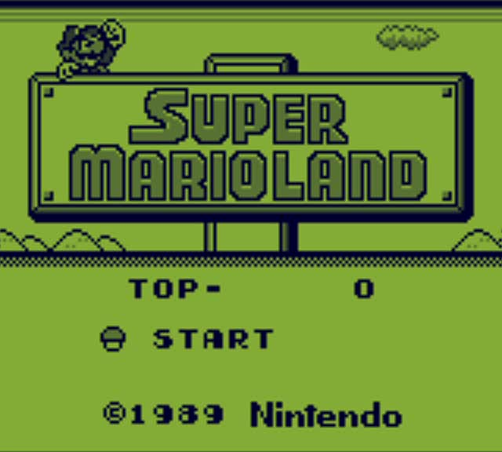

# PixelBoy
A GameBoy emulator written from scratch in C. It is not yet complete, but multiple games are fully playable, and many features have been emulated.

## Features

 - Fully functional CPU (all opcodes implemented, passes 11/11 blargg's test ROMs)
 - Mostly complete memory controller that dispatches R/W to the corresponding modules
 - PPU that draws scanline by scanline but is not cycle accurate and causes some graphical bugs
 - MBC1 ROM support (more mappers will be added eventually)
 - Handmade OpenGL frontend made with GLFW. Custom shader used for the green palette.
 - Drag and drop ROM files to load them into the emulator
 - WIP Audio emulation
 - Tiny binary! MinSizeRel build on MSVC produces a 600 kB standalone executable.
 - Runs with just 20 MB of RAM and uses very little CPU and GPU

### Mappings:
|GameBoy|Mapping|
|--|--|
|D-Pad|Directional arrows|
|A|S|
|B|Q|
|Select|Left shift|
|Start|Enter|

## Setup
 - Clone the repository `https://github.com/razor7877/PixelBoy.git`
 - Download the dependencies `git submodule update --init --recursive`
 - The project can then be built using the included CMake.
 
It works on Linux (makefile/GCC) and Windows (Visual Studio/MSVC) and might work on MacOS too (untested). There is no platform dependent code.

 ### Dependencies:

 - GLFW: Windowing, inputs and OpenGL context management
 - glad: OpenGL functions loading
 - PortAudio: Low-level library for generating sound on the fly