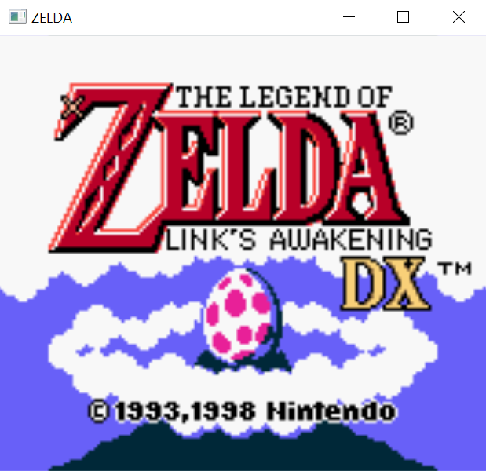
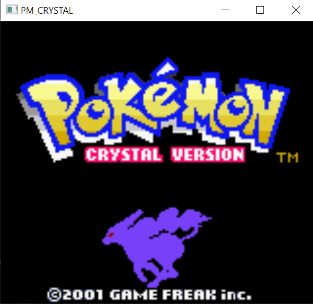
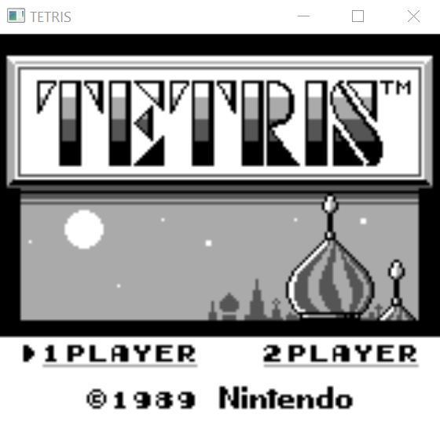

# PixelBoy
A GameBoy and GameBoy Color emulator written from scratch in C. It is not yet complete, but plenty of games are fully playable, and many features have been emulated. GameBoy emulation is quite complete, GBC emulation is in progress.

## Features

 - Fully functional CPU (all opcodes implemented, passes 11/11 blargg's test ROMs)
 - Complete memory controller that dispatches R/W to the corresponding modules
 - PPU that draws scanline by scanline but is not cycle accurate and causes some graphical bugs
 - MBC1/2/3/5 ROM support (including MBC3 RTC)
 - Save system
 - WIP GBC Emulation (missing HDMA transfers & some bugs to be fixed)
 - Handmade OpenGL frontend made with GLFW
 - Drag and drop ROM files to load them into the emulator
 - WIP Audio emulation (most of the APU emulation done, and sound generation using PortAudio)
 - Tiny binary! Release build on MSVC produces a 600 kB standalone executable.
 - Runs with just 20 MB of RAM and uses very little CPU and GPU

### Mappings:
|GameBoy|Mapping|
|--|--|
|D-Pad|Directional arrows|
|A|S|
|B|Q|
|Select|Left shift|
|Start|Enter|

## Setup
 - Clone the repository `https://github.com/razor7877/PixelBoy.git`
 - Download the dependencies `git submodule update --init --recursive`
 - The project can then be built using the included CMake.
 
It works on Linux (makefile/GCC), Windows (Visual Studio/MSVC) and MacOS (XCode). All dependencies are cross-platform.

 ### Dependencies:

 - GLFW: Windowing, inputs and OpenGL context management
 - glad: OpenGL functions loading
 - PortAudio: Low-level library for generating sound on the fly
